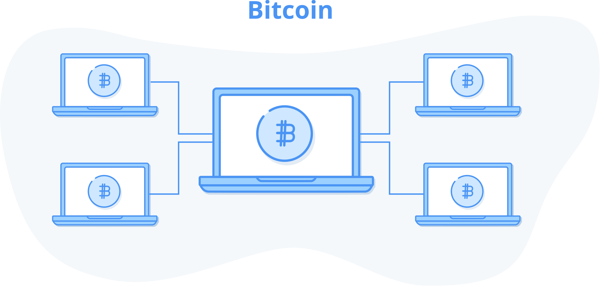

## Cos'è Bitcoin?

Bitcoin è un *sistema di moneta elettronica peer to peer*, una nuova forma di denaro digitale che può essere trasferito tra persone o computer senza alcun intermediario fidato (come una banca) e la cui emissione non è sotto il controllo di una singola parte. 

Pensa ad un dollaro di carta o ad una moneta fisica di metallo. Quando dai quel denaro ad un'altra persona, questa non ha bisogno di sapere chi sei. Deve solo fidarsi che il denaro che riceve da te non sia falsificato. Con il denaro fisico, di solito, le persone lo fanno semplicemente con gli occhi e con le dita, oppure utilizzando speciali apparecchiature di verifica nel caso di somme più consistenti.

Da quando siamo diventati una società digitale, la maggior parte dei pagamenti viene effettuata su Internet tramite un servizio di intermediazione: una società di carte di credito come Visa, un gestore di pagamenti digitali come PayPal o Apple Pay, o una piattaforma online come WeChat in Cina.

Il passaggio ai pagamenti digitali comporta la dipendenza da un attore centrale che deve approvare e verificare ogni pagamento. Questo perché la natura del denaro è cambiata: da un oggetto fisico che si può trasportare, trasferire e verificare da soli, a bit digitali che devono essere memorizzati e verificati da una terza parte che ne controlla il trasferimento.

Se rinunciamo al denaro contante in cambio di comodi pagamenti digitali, creiamo anche un sistema in cui diamo poteri straordinari a coloro che potrebbero cercare di opprimerci. Le piattaforme di pagamento digitale sono diventate una base per sistemi di controllo autoritari e distopici, come quelli utilizzati dal governo cinese per monitorare i dissidenti e impedire ai cittadini il cui comportamento non è gradito di acquistare beni e servizi.

Bitcoin offre un'alternativa al denaro digitale controllato a livello centrale grazie ad un sistema che ci restituisce la stessa possibilità di transare da persona a persona del denaro contante, ma in forma digitale:

1.  Un bene digitale (tipicamente *bitcoin* con la *b* minuscola) la cui offerta è limitata, conosciuta fin dall'inizio e immutabile. Ciò è in netto contrasto con le banconote e le loro versioni digitali emesse da governi e banche centrali, la cui offerta si espande ad un ritmo imprevedibile.
2.  Un gruppo di computer interconnessi (la *rete Bitcoin*), a cui chiunque può aderire eseguendo un software. Questa rete serve a emettere bitcoin, a tracciarne il possesso e a trasferirli tra i partecipanti senza dover ricorrere a intermediari come banche, società di pagamento ed enti governativi.
3.  Il client software Bitcoin, un pezzo di codice che chiunque può eseguire sul proprio computer per divenire un partecipante della rete. Questo software è open source, il che significa che chiunque può vedere come funziona e contribuire con nuove funzionalità e correzioni di bug.

*Bitcoin è una rete di computer che eseguono il software client Bitcoin*.

Nella prossima sezione approfondiremo le motivazioni alla base di Bitcoin.

### Come è nato?

Bitcoin è stato inventato da una persona o un gruppo noto con lo pseudonimo di [Satoshi Nakamoto](https://it.wikipedia.org/wiki/Satoshi_Nakamoto) intorno al 2008. Nessuno conosce l'identità di questa persona o di questo gruppo e, per quanto ne sappiamo, sono spariti e non se ne hanno notizie da anni.

L'11 febbraio 2009, Satoshi ha scritto di una prima versione di Bitcoin su un forum online per *cypherpunks*, persone che lavorano sulla tecnologia della crittografia e si dedicano alla privacy e alla libertà individuale. Sebbene questo non sia il primo annuncio ufficiale del rilascio di Bitcoin, contiene un buon riassunto delle motivazioni di Satoshi, quindi lo useremo per gettare le basi della nostra discussione.

Le parti rilevanti sono estratte di seguito. Nella prossima sezione, esamineremo alcune di queste dichiarazioni e cercheremo di capire quali problemi dell'attuale sistema finanziario Satoshi intendeva risolvere:

> *Ho sviluppato un nuovo sistema open source P2P di moneta elettronica chiamato Bitcoin. È completamente decentralizzato, senza server centrali o parti fidate, perché tutto si basa sulla prova crittografica anziché sulla fiducia. \[...\]*
>
> *Il problema fondamentale della moneta convenzionale è la fiducia che è necessaria per farla funzionare. Bisogna fidarsi del fatto che la banca centrale non svaluti la moneta, ma la storia delle valute fiat è piena di tradimenti di questa fiducia. Dobbiamo affidare alle banche il compito di custodire il nostro denaro e di trasferirlo elettronicamente, ma loro lo prestano in ondate di bolle di credito mantenendone a malapena una piccola parte come riserva. Dobbiamo affidare a loro la nostra privacy, sperando che non lascino che i ladri di identità prosciughino i nostri conti correnti. I loro enormi costi di gestione rendono impossibili i micropagamenti.*
>
> *Una generazione fa, i sistemi informatici multiutente di condivisione del tempo avevano un problema analogo. Prima dell'introduzione della crittografia avanzata, per proteggere i propri file gli utenti dovevano affidarsi alle password.*
>
> *Da quando la crittografia avanzata è stata resa disponibile alle masse, la fiducia non è più stata necessaria. I dati hanno potuto essere protetti in modo tale da rendere fisicamente impossibile l'accesso da parte di terzi, per qualsiasi motivo, a prescindere dalla scusa, senza eccezioni.*
>
> *È ora che la stessa cosa valga anche per il denaro. Con una moneta elettronica basata sulla prova crittografica e senza la necessità di fidarsi di un intermediario di terze parti, il denaro può essere sicuro e le transazioni possono essere effettuate senza difficoltà. \[...\]*
>
> *La soluzione offerta da Bitcoin consiste nell'utilizzare una rete peer-to-peer per rilevare eventuali doppie spese. In poche parole, la rete funziona come un servizio di timestamp (N.d.T.: marcatura temporale) distribuito, che contrassegna la prima transazione che spende una moneta. Sfrutta la peculiarità dell'informazione di essere facile da diffondere ma difficile da limitare. Per i dettagli sul suo funzionamento, si veda il documento di progetto all'indirizzo [[https://bitcoin.org/files/bitcoin-paper/bitcoin_it.pdf]](http://www.bitcoin.org/bitcoin.pdf).*
>
> Satoshi Nakamoto

### Quali problemi risolve?

Esaminiamo in dettaglio il post di Satoshi. Nel corso del libro, tratteremo il modo in cui questi concetti vengono effettivamente implementati. Non preoccuparti se qualcosa non ti risulta comprensibile in questa sezione, perché la tratteremo in modo approfondito più avanti. Lo scopo è quello di comprendere gli obiettivi di Satoshi, in modo da poterli raggiungere durante l'esercizio di *Inventare Bitcoin*.

> *Ho sviluppato un nuovo sistema open source P2P di moneta elettronica*.

P2P è l'acronimo di *peer to peer* e indica un sistema in cui due persone interagiscono tra loro come soggetti alla pari, senza bisogno di qualcuno in mezzo. Forse ricorderete le tecnologie di condivisione di file P2P come Napster, Kazaa e BitTorrent, che per prime hanno permesso alle persone di condividere musica e film tra loro senza intermediari. Satoshi ha progettato Bitcoin per consentire alle persone di scambiare *e-cash*, contante elettronico, senza ricorrere ad un intermediario, più o meno nello stesso modo.

Il software è *open source*, il che significa che chiunque può vedere come funziona e migliorarlo. Questo è importante perché elimina l'obbligo di fidarsi di Satoshi. Non dobbiamo credere a tutto ciò che Satoshi ha scritto nel suo post sul funzionamento del software. Possiamo guardare il codice e verificarne il funzionamento da soli. Inoltre, possiamo migliorare la funzionalità del sistema modificando il codice.

> *È completamente decentralizzato, senza server centrale o parti fidate...*

Satoshi indica che il sistema è *decentralizzato* per distinguerlo dai sistemi che hanno un controllo centrale. I precedenti tentativi di creare denaro digitale, come DigiCash di David Chaum, erano basati su un *server centrale*, un computer o un insieme di computer responsabili dell'emissione e della verifica dei pagamenti, che erano controllati da una società.

Questi modelli di moneta privata controllata centralmente erano destinati al fallimento: le persone non possono fare affidamento su una moneta che può scomparire se l'azienda fallisce, viene hackerata, ha un blocco del server o viene chiusa dal governo.

Bitcoin, invece, non è gestito e controllato da una singola azienda, ma piuttosto da una rete di individui e aziende in tutto il mondo. Per chiudere Bitcoin sarebbe necessario spegnere decine o centinaia di migliaia di computer in tutto il mondo, molti dei quali in località ignote. Sarebbe del tutto inutile provarci, poiché qualsiasi attacco di questa natura incoraggerebbe semplicemente la creazione di nuovi *nodi* Bitcoin, o computer della rete.

> *...tutto si basa sulla prova crittografica anziché sulla fiducia.*

Internet, e di fatto la maggior parte dei sistemi informatici moderni, sono costruiti sulla crittografia, un metodo per oscurare le informazioni in modo che solo chi le riceve possa decodificarle. Come fa Bitcoin a sbarazzarsi del requisito della *fiducia*? Approfondiremo questo aspetto più avanti nel libro, ma l'idea di base è che invece di fidarsi di qualcuno che dice "Sono Alice" o "Ho 10 dollari sul mio conto", possiamo usare la matematica crittografica per affermare gli stessi fatti in un modo che è molto facile da verificare da parte del destinatario della prova, ma impossibile da falsificare. Bitcoin utilizza la matematica della crittografia in tutto il suo funzionamento per consentire ai partecipanti di verificare il comportamento di tutti gli altri senza doversi fidare di un'autorità centrale.

> *Dobbiamo affidare \[alle banche\] la nostra privacy, sperando che non lascino che i ladri di identità prosciughino i nostri conti correnti.*

Rispetto al tuo conto corrente, sistema di pagamento digitale o carta di credito, Bitcoin consente a due parti di effettuare transazioni senza rivelare alcuna informazione sulla propria identità. Gli archivi centralizzati di dati dei consumatori memorizzati presso banche, società di carte di credito, gestori di pagamenti e governi, costituiscono delle immense e preziosissime prede per gli hacker. A riprova della tesi di Satoshi, nel 2017 Equifax è stata compromessa in modo clamoroso, rivelando agli hacker le identità e i dati finanziari di oltre 140 milioni di persone.

Bitcoin separa le transazioni finanziarie dalle identità del mondo reale. Dopotutto, quando diamo del denaro fisico a qualcuno, non è necessario che sappia chi siamo, né dobbiamo preoccuparci che dopo il nostro scambio costui possa usare alcune informazioni che gli abbiamo dato per rubarci del denaro. Perché non dovremmo aspettarci lo stesso, o addirittura di meglio, dal denaro digitale?

> *Bisogna fidarsi del fatto che la banca centrale non svaluti la moneta, ma la storia delle valute fiat è piena di tradimenti di questa fiducia.*

Il termine *fiat*, che in latino significa "che sia fatto", si riferisce alla moneta emessa dal governo e dalla banca centrale e decretata come moneta a corso legale dal governo stesso. Storicamente, il denaro veniva creato da oggetti difficili da produrre, facili da verificare e da trasportare, come conchiglie, perle di vetro, argento e oro. Ogni volta che qualcosa veniva usato come denaro, c'era la tentazione di crearne di più. Se arrivava qualcuno con una tecnologia superiore per creare rapidamente ingenti quantità di qualcosa, quella cosa perdeva valore. È così che i coloni europei sono stati in grado di spogliare il continente africano della sua ricchezza, scambiando perle di vetro facili da creare con schiavi umani difficili da reperire. Questo è il motivo per cui l'oro è stato considerato una moneta così buona per così tanto tempo: era difficile produrne di più rapidamente[^1].

Siamo passati lentamente da un'economia mondiale che utilizzava l'oro come moneta, ad un'economia in cui i certificati cartacei venivano emessi come credito su quell'oro. Alla fine, la carta fu completamente separata da qualsiasi supporto fisico quando Nixon, nel 1971, pose fine alla convertibilità internazionale del dollaro statunitense in oro.

La fine del gold standard permise ai governi e alle banche centrali di aumentare a piacimento l'offerta di moneta, diluendo il valore di ogni banconota in circolazione, con la cosiddetta "svalutazione". Sebbene la pura moneta fiat, emessa dai governi e riscattabile in cambio di nulla, sia il denaro che tutti noi conosciamo e utilizziamo quotidianamente, di fatto si tratta di un esperimento relativamente nuovo nell'ambito della storia mondiale.

Dobbiamo confidare che i nostri governi non abusino della loro stampante di denaro, ma non c'è bisogno di guardare molto indietro per trovare esempi di *violazioni di questa fiducia*. Nei regimi autocratici e pianificati centralmente, dove il governo ha il controllo diretto sul sistema monetario, come nel caso del Venezuela, la moneta è diventata quasi priva di valore. Il Bolivar venezuelano è passato da 2 Bolivar per dollaro statunitense nel 2009 a 250.000 Bolivar per dollaro statunitense nel 2019. Mentre scrivo questo libro, il Venezuela è al collasso a causa della pessima gestione dell'economia da parte del suo governo.

Satoshi voleva offrire un'alternativa alla valuta *fiat* la cui offerta si espande sempre in modo imprevedibile. Per evitare la *svalutazione*, Satoshi ha progettato un sistema monetario in cui l'offerta è fissa ed emessa ad un tasso prevedibile e immutabile. Ci saranno sempre e solo 21 milioni di bitcoin, anche se ogni bitcoin può essere diviso in 100 milioni di unità, ora chiamate satoshi (N.d.T: abbreviato in "sats"), per un totale complessivo di 2,1 quadrilioni di satoshi in circolazione verso l'anno 2140.

Prima di Bitcoin, non era possibile impedire che un bene digitale venisse riprodotto all'infinito. È facile ed economico copiare un libro digitale, un file audio o un video, e inviarlo ad un amico. L'unica eccezione è rappresentata dagli asset digitali controllati da intermediari. Ad esempio, se noleggiate un film da iTunes, potete guardarlo sul vostro dispositivo solo perché iTunes controlla la trasmissione del film e può interromperla al termine del periodo di noleggio. Allo stesso modo, il tuo denaro digitale è controllato dalla tua banca. È compito della banca tenere un registro di quanto denaro hai e, se lo trasferisci a qualcun altro, può autorizzare o negare tale trasferimento.

Bitcoin è il primo sistema digitale che garantisce la scarsità senza intermediari ed è il primo bene conosciuto dall'umanità la cui offerta immutabile e il cui programma di emissione sono perfettamente noti in anticipo. Nemmeno i metalli preziosi come l'oro hanno questa proprietà, poiché possiamo continuare ad estrarre sempre più oro, a patto che sia redditizio farlo. Immagina che venga scoperto un asteroide contenente una quantità d'oro dieci volte superiore a quella che abbiamo sulla Terra. Cosa succederebbe al prezzo dell'oro in presenza di un'offerta così abbondante? Bitcoin è immune da tali scoperte e manipolazioni dell'offerta. È semplicemente impossibile produrne di più, e spiegheremo perché nei capitoli successivi.

La natura del denaro e il funzionamento del sistema monetario esistente sono intricati, e questo libro non li tratterà in modo approfondito. Se volete saperne di più sui principi fondamentali del denaro applicati a Bitcoin, ti consiglio di partire dalla lettura de *Il Bitcoin Standard* di Saifedean Ammous.

> *I dati hanno potuto essere protetti in modo tale da rendere fisicamente impossibile l'accesso da parte di terzi, per qualsiasi motivo, a prescindere dalla scusa, senza eccezioni. \[...\] È ora che la stessa cosa valga anche per il denaro.*

I nostri attuali sistemi di protezione del denaro, come il deposito in banca, si basa sull'affidabilità dell'intermediario che svolge questo compito. La fiducia riposta in questo intermediario non richiede solo la convinzione che non compia azioni malevole o sconsiderate, ma anche che il governo non sequestri o congeli i tuoi fondi esercitando pressioni su questo intermediario. Tuttavia, è stato dimostrato più volte che i governi possono bloccare l'accesso al denaro quando si sentono minacciati.

A chi vive negli Stati Uniti, o in un'altra economia altamente regolamentata, potrebbe sembrare assurdo pensare di svegliarsi con i propri soldi volatilizzati, ma succede di continuo. Mi è capitato di vedermi congelare i fondi da PayPal semplicemente perché non usavo il mio conto da mesi. Mi ci è voluta più di una settimana per ottenere il ripristino dell'accesso al "mio" denaro. Sono fortunato ad abitare negli Stati Uniti, dove, se PayPal bloccasse i miei fondi, potrei quantomeno sperare di ottenere un risarcimento legale, e dove nutro un minimo di fiducia nel fatto che il mio governo e la mia banca non mi derubino.

In Paesi con meno libertà, sono accadute, e stanno accadendo, cose ben peggiori, come [la chiusura delle banche durante i crolli valutari](https://www.nbcnews.com/business/business-news/greece-crisis-banks-shut-week-restrictions-imposed-atms-n383606) in Grecia, le banche di Cipro che propongono salvataggi bancari attraverso la confisca dei fondi dei loro clienti, o [il governo che dichiara senza valore alcune banconote](https://www.washingtonpost.com/world/asia_pacific/india-invalidates-large-bank-notes-in-crackdown-on-crime/2016/11/08/cc705ee2-a5c6-11e6-ba46-53db57f0e351_story.html?utm_term=.7951cf519c00) in India.

L'ex Unione Sovietica, dove sono cresciuto, aveva un'economia controllata dal governo che portava ad una massiccia carenza di beni. Era illegale possedere valute straniere come il dollaro statunitense. Quando abbiamo deciso di andarcene, abbiamo potuto cambiare in dollari statunitensi solo una quantità limitata di denaro per persona, in base ad un tasso di cambio ufficiale imposto dal governo che si discostava notevolmente dal vero tasso del libero mercato. Di fatto, il governo ci ha privato di quel poco di ricchezza che avevamo, mantenendo un controllo ferreo sull'economia e sulla circolazione dei capitali.

I Paesi autocratici tendono ad attuare rigidi controlli economici, impedendo alle persone di ritirare il proprio denaro dalle banche, di portarlo fuori dal Paese o di scambiarlo con valute non ancora prive di valore, come il dollaro statunitense sul libero mercato. Questo permette al governo di attuare esperimenti economici folli come il sistema socialista dell'URSS.

Bitcoin, per proteggere il tuo denaro, non si basa sulla fiducia in una terza parte. Al contrario, Bitcoin rende le tue monete *impossibili da accedere per gli altri* senza una chiave speciale che solo tu possiedi, *per qualsiasi motivo, a prescindere dalla scusa, senza eccezioni*. Detenendo Bitcoin, hai le chiavi della tua libertà finanziaria. Bitcoin separa il denaro e lo Stato.

> *La soluzione di Bitcoin consiste nell\'utilizzare una rete peer-to-peer per rilevare eventuali doppie spese. \[...\] come un servizio di timestamp distribuito, che contrassegna la prima transazione che spende una moneta.*

Il concetto di *rete* si riferisce all'idea che un gruppo di computer sia interconnesso e possa inviare messaggi l'uno all'altro. La parola *distribuita* significa che non c'è una parte centrale che esercita il controllo, ma piuttosto che tutti i partecipanti si coordinano per far sì che la rete abbia successo.

In un sistema senza controllo centrale, è importante sapere che nessuno stia imbrogliando. L'idea di *doppia spesa* si riferisce alla possibilità di spendere lo stesso denaro due volte. Questo non è un problema con il denaro fisico, perché passa da una mano all'altra quando lo si spende. Le transazioni digitali, invece, possono essere copiate proprio come la musica o i film. Quando si invia denaro attraverso una banca, questa si prende cura del fatto che lo stesso denaro non venga spostato due volte. In un sistema senza controllo centrale, abbiamo bisogno di un modo per prevenire questo tipo di *doppia spesa*, che equivale a falsificare il denaro.

Satoshi spiega che i partecipanti alla rete Bitcoin collaborano per *timestampare* (mettere in ordine temporale) le transazioni, in modo da conoscere quale sia stata la prima, così da poter respingere qualsiasi tentativo futuro di spendere nuovamente lo stesso denaro. Nei prossimi capitoli costruiremo questo sistema dalle fondamenta. Questo ci permetterà di individuare le falsificazioni senza affidarci ad un emittente centrale o ad un validatore di transazioni.

***

Bitcoin non è stata un'invenzione fatta dal nulla. Nel suo documento, Satoshi ha citato diversi importanti tentativi di implementare sistemi simili, tra cui b-money di Wei Dai e Hashcash di Adam Back. L'invenzione di Bitcoin poggia sulle spalle di giganti, ma nessuno prima di lui aveva messo insieme tutti i pezzi giusti, creando il primo sistema per l'emissione ed il trasferimento di una moneta digitale veramente scarsa senza un controllo centrale. 

Satoshi ha superato una serie di interessanti problemi tecnici per affrontare le questioni della privacy, della svalutazione e del controllo centrale negli attuali sistemi monetari:

1.  Come creare una rete peer to peer che permetta a chiunque di aderire e partecipare volontariamente.
2.  Come un gruppo di persone che non devono rivelare la propria identità o fidarsi l'uno dell'altro può mantenere un libro mastro condiviso di valore, anche se alcuni di loro sono disonesti.
3.  Come consentire alle persone di emettere la propria moneta non falsificabile senza affidarsi ad un emittente centrale, mantenendo al contempo la scarsità di tale moneta in modo che la produzione di nuove unità non vada fuori controllo.

Quando Bitcoin fu lanciato, solo poche persone lo utilizzavano e facevano girare il software Bitcoin sui loro computer o *nodi* per alimentare la rete Bitcoin. All'epoca, la maggior parte delle persone pensava che si trattasse di uno scherzo o che il sistema avrebbe rivelato gravi difetti di progettazione che lo avrebbero reso impraticabile.

Nel corso del tempo, sempre più persone si sono unite alla rete, utilizzando i loro computer per aggiungere sicurezza alla rete e rafforzando il valore di Bitcoin scambiando altre valute o accettandolo in cambio di beni e servizi. Oggi, dieci anni dopo, è utilizzata da milioni di persone con decine o centinaia di migliaia di nodi che eseguono il software libero Bitcoin, sviluppato da centinaia di volontari e aziende in tutto il mondo.

Scopriamo come costruire questo sistema!

***
[^1]: Per un'ottima panoramica della storia monetaria, consiglio il saggio *Shelling Out* di Nick Szabo: <https://nakamotoinstitute.org/shelling-out/>

