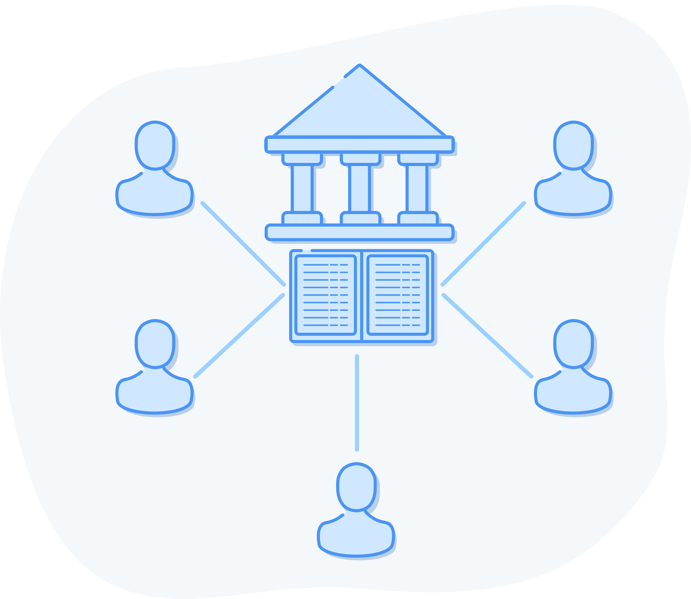
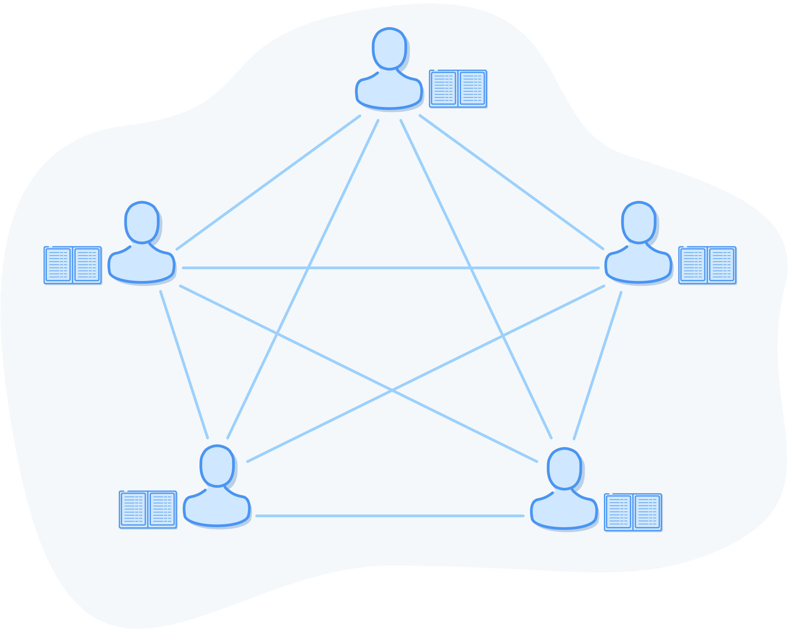

## Eliminare l\'intermediario

Nel capitolo precedente abbiamo detto che Bitcoin offre un sistema *peer to peer* per trasferire valore. Prima di approfondire il funzionamento di questo sistema, dobbiamo capire come una banca tradizionale o una società specializzata in pagamenti si occupi di tracciare la proprietà e i trasferimenti di fondi.

### Le banche sono solo libri mastri

Come funziona un pagamento digitale effettuato dalla vostra banca, da PayPal o da ApplePay? Molto semplicemente, questi intermediari agiscono come una sorta di libro mastro di conti e trasferimenti.

Lo scopo di una banca è quello di conservare i tuoi depositi e di custodirli. Ma al giorno d'oggi i depositi sono principalmente elettronici, e non più monete o carta. Di conseguenza, il compito di una banca è ora quello di mantenere e custodire semplicemente un database di informazioni. Poiché i dati sono elettronici, anche le guardie di sicurezza sono per lo più elettroniche. Le banche utilizzano software per il rilevamento delle intrusioni, backup per prevenire la perdita di dati, audit da parte di terzi per assicurarsi che i loro processi interni non siano compromessi e assicurazioni per cautelarsi nel caso in cui qualcosa vada storto.

Ecco come funzionano. In questo esempio, diremo *banca* ma in realtà con questo termine intendiamo qualsiasi altro soggetto che gestisce i pagamenti. Partiamo da un registro dei conti che mostra che Alice e Bob hanno depositato del denaro presso la banca.

> Libro mastro della banca
> 
> 1.  Alice: Credito per deposito di contanti +2 €
> 2.  Bob: Credito per deposito di contanti +10 €

Per inviare 2 € a Bob, Alice chiama la sua banca o utilizza un conto web o mobile messo a disposizione dalla sua banca, si autentica utilizzando un nome utente e una password o un codice pin, quindi inoltra la richiesta di trasferimento. La banca registra tutto ciò nel proprio libro mastro.

> Libro mastro della banca
> 
> 1.  Alice: Credito per deposito di contanti +2 €
> 2.  Bob: Credito per deposito di contanti +10 €
> 3.  Alice: Addebito -2 €
> 4.  Bob: Credito +2 €

La banca ha quindi registrato i nuovi addebiti e accrediti ed ora il denaro si è mosso.

### Il problema della doppia spesa

Cosa succede se Alice prova a spendere di nuovo quei due euro? Questo è il cosiddetto problema della doppia spesa. Alice inoltra la richiesta alla banca ma questa le risponde: "Ci dispiace, abbiamo visto che ha già speso 2 euro per pagare Bob. Non ha più denaro da inviare". 

In presenza di un'autorità centrale come una banca, per quest'ultima è molto facile capire che si sta cercando di spendere del denaro che si è già speso. Questo perché sono gli unici a poter modificare il libro mastro e hanno processi interni che includono sistemi di backup e controlli automatici o manuali per assicurarsi che il libro mastro sia corretto e non sia stato manomesso.

Lo chiamiamo sistema *centralizzato* perché ha un unico punto di controllo.

*La banca conserva un libro mastro a cui tutti possono accedere, ma solo passando attraverso la banca.*

### Distribuire il libro mastro

Il primo problema che Bitcoin si propone di risolvere è l'eliminazione dell'intermediario fidato, creando un sistema *peer to peer*. Immaginiamo che le banche siano scomparse e che occorra ricreare il nostro sistema finanziario. Come possiamo gestire un libro mastro senza un'entità centrale?

In assenza di una contabilità centralizzata, il libro mastro deve appartenere al popolo. Vive la révolution. Ecco come fare.

Innanzitutto, un gruppo di noi si riunisce e crea una *rete*. Questo significa che abbiamo un modo per parlare tra di noi. Diciamo che ci scambiamo numeri di telefono o account Telegram. Quando Alice vuole inviare denaro a Bob, invece di chiamare la banca, dice a tutti i suoi amici: "Sto inviando 2 euro a Bob". Tutti rispondono: "Bene, abbiamo capito" e scrivono il messaggio nella propria copia del libro mastro. Il quadro ora si presenta così:

*Ognuno ha una copia del libro mastro a cui può accedere in modo indipendente.*

Così adesso, anziché dipendere da una singola banca, abbiamo tutti a disposizione una copia del libro mastro. Ogni volta che qualcuno vuole spendere del denaro, deve semplicemente dirlo a tutti i suoi amici. Tutti annotano le transazioni. Poiché il libro mastro non si trova più in un unico luogo, lo chiamiamo *distribuito* e, poiché non c'è una figura centrale al comando, lo chiamiamo *decentralizzato*. Questo risolve la questione dell'eliminazione dell'intermediario.

Ora che non abbiamo un intermediario, come faremo a gestire le doppie spese? Chi consulteremo al posto della banca per verificare se il denaro che si sta spendendo è stato già stato speso? Dal momento che tutti hanno una copia del libro mastro, è necessario consultare tutti. Questo sistema è chiamato *consenso* perché si basa sul fatto che tutti concordino su una particolare versione della verità.

Se Alice cercasse di spendere nuovamente i 2 euro che ha già inviato a Bob, la sua transazione verrebbe rifiutata da tutti i membri della rete, poiché questi consulterebbero i loro libri mastri e le direbbero che, secondo i loro registri, ha già speso quel denaro. Pertanto, non registrerebbero il suo secondo tentativo di spendere denaro già speso. Ora abbiamo una rete di consenso peer to peer per registrare il possesso e il trasferimento di fondi.

Finché il nostro libro mastro distribuito richiede un *permesso* di adesione e possiamo *fidarci* che ogni parte sia onesta, il sistema funziona. Ma questo tipo di progetto non può essere utilizzato da milioni di persone in tutto il mondo. I sistemi distribuiti composti da partecipanti arbitrari sono intrinsecamente inaffidabili. Alcune persone potrebbero occasionalmente andare offline. Ciò significa che potrebbero non venire a conoscenza delle nostre transazioni quando le trasmettiamo. Altri potrebbero cercare attivamente di frodarci dicendo che certe transazioni sono avvenute o non sono avvenute. Nuove persone possono unirsi alla rete e ottenere copie contrastanti del libro mastro. 

Vediamo come qualcuno potrebbe cercare di imbrogliare.

### L\'attacco della doppia spesa

Se sono Alice, posso *accordarmi* con altre persone e dire loro: "Quando spendo dei soldi, non scriveteli nei vostri libri mastri. Fate finta che non sia mai successo". Ecco come Alice può eseguire un attacco di doppia spesa.

Partendo da un saldo di 2 euro, Alice esegue le seguenti operazioni:

1.  Invia i suoi 2 euro a Bob, per comprare una barretta di cioccolato. Ora dovrebbe avere 0 euro.
2.  Davide, Eva e Francesca sono complici di Alice e non scrivono la transazione da Alice a Bob nel loro libro mastro. Nella loro copia, Alice non ha mai speso i suoi soldi ed ha ancora un saldo di 2 euro.
3.  Carlotta è una custode onesta del libro mastro. Annota la transazione da Alice a Bob. Nel suo libro mastro, Alice ha 0 euro.
4.  Enrico è stato in vacanza per una settimana e non ha sentito parlare di nessuna di queste transazioni. Si unisce alla rete e chiede una copia del libro mastro.
5.  Enrico riceve 4 copie false (da Davide, Eva, Francesca e Alice) ed una copia onesta (da Carlotta). Come fa a determinare quale sia quella vera? Non disponendo di un sistema migliore, si fida della maggioranza dei partecipanti e viene ingannato, accettando il libro mastro falso come quello corretto.
6.  Alice compra una barretta di cioccolato da Enrico usando 2 euro che in realtà non ha. Enrico accetta perché, per quanto ne sa, Alice ha ancora 2 euro sul suo conto secondo il libro mastro che ha ricevuto da tutti gli altri.
7.  Alice ora ha 2 barrette di cioccolato e nel sistema sono stati creati 4 euro di denaro falso. Paga i suoi amici in barrette di cioccolato e ripete l'attacco 100 volte su ogni nuova persona che si unisce alla rete. 
8.  Alice adesso possiede tutte le barrette di cioccolato e tutti gli altri si ritrovano in mano grandi sacchi di denaro falso. 
9.  Quando cercano di spendere il denaro che Alice avrebbe inviato loro, Davide, Eva e Francesca, che controllano la maggior parte della rete, rifiutano queste spese perché sanno che il denaro è falso.

Si tratta del cosiddetto *fallimento del consenso*: le persone della rete non sono giunte ad un consenso su quale sia lo stato della realtà. Non avendo un sistema migliore, hanno scelto la regola della maggioranza, che ha portato persone disoneste a controllare la rete spendendo denaro che non possedevano. 

Se vogliamo creare un sistema *senza permessi* in cui chiunque possa partecipare senza chiedere, allora è necessario che sia resistente anche agli attori disonesti.

### Risolvere il problema del consenso distribuito

Ora si tratta di risolvere uno dei problemi più difficili dell'informatica: il consenso distribuito tra soggetti che sono in parte disonesti o inaffidabili. Questo problema è noto come [Problema dei generali bizantini](https://it.wikipedia.org/wiki/Problema_dei_generali_bizantini) ed è la chiave che Satoshi Nakamoto ha usato per rendere possibile l'invenzione di Bitcoin. Dobbiamo fare in modo che un gruppo di persone sia d'accordo sulle voci del libro mastro senza sapere quali custodi del libro mastro abbiano annotato tutte le transazioni in modo corretto e onesto.

Una soluzione ingenua è semplicemente quella di nominare dei custodi del libro mastro onesti. Invece di far scrivere tutti sul registro, scegliamo una manciata di amici come Carlotta, Mario, Franco e Sonia, perché non dicono bugie e tutti sanno che non fanno mai baldoria nei fine settimana.

Così, ogni volta che dobbiamo elaborare una transazione, invece di dirlo a tutti i nostri amici, chiamiamo Carlotta e la sua banda. Sono felici di gestire il libro mastro per noi, dietro pagamento di una piccola somma. Dopo aver scritto sul libro mastro, chiamano tutti gli altri e comunicano loro le nuove voci del libro mastro, che tutti conservano come backup.

Questo sistema funziona molto bene, ma un giorno arrivano degli agenti governativi che vogliono sapere chi gestisce questo sistema finanziario ombra. Arrestano Carlotta e i suoi amici e li portano via, mettendo fine al nostro libro mastro distribuito. Abbiamo tutti dei backup inaffidabili, non possiamo fidarci l'uno dell'altro e non riusciamo a capire quale backup debba essere usato per ricominciare con un nuovo sistema.

Invece di un completo blocco, il governo può anche minacciare silenziosamente i custodi del nostro libro mastro di andare in prigione se accettano transazioni verso Alice (che è sospettata di vendere droga). Il sistema è ora effettivamente sotto un controllo centrale e non possiamo più chiamarlo permissionless.

E se provassimo con la democrazia? Troviamo un gruppo di 50 persone oneste e facciamo delle elezioni ogni giorno per tenere a rotazione chi può scrivere sul libro mastro. Tutti i membri della rete hanno diritto a un voto. 

Questo sistema funziona benissimo fino a quando non arrivano persone che usano la violenza o la coercizione finanziaria per raggiungere gli stessi scopi di prima:

1.  Costringere l'elettorato a votare per i custodi del libro mastro di loro scelta.
2.  Forzare i custodi del libro mastro eletti a scrivere voci false nel libro mastro o ad impedire l'elaborazione di determinate transazioni.

Abbiamo un problema. Ogni volta che nominiamo persone specifiche per la gestione del libro mastro, dobbiamo fidarci della loro onestà e non abbiamo modo di difenderle se qualcuno le vuole costringere a compiere azioni disoneste, corrompendo il nostro libro mastro.

### Identità errata e attacchi Sybil

Finora abbiamo esaminato due metodi fallimentari per garantire l'onestà: uno utilizzava dei custodi del libro mastro specifici e conosciuti, mentre l'altro utilizzava custodi del libro mastro eletti a rotazione. Il fallimento di entrambi i sistemi era dovuto al fatto che la base della nostra fiducia era legata all'identità del mondo reale: dovevamo identificare specificamente gli individui che sarebbero stati responsabili del nostro libro mastro. Ogni volta che assumiamo una fiducia basata sull'identità, ci esponiamo a qualcosa chiamato [Attacco di Sybil](https://it.wikipedia.org/wiki/Attacco_di_Sybil). Si tratta di un nome di fantasia ispirato all'impersonificazione; prende il nome da una donna affetta da disturbo di personalità multipla.

Avete mai ricevuto uno strano messaggio da un vostro amico per poi scoprire che il suo telefono era stato hackerato? Quando ci sono in gioco miliardi o addirittura trilioni di dollari, le persone giustificano ogni tipo di violenza per rubare quel telefono e inviare quel messaggio. È assolutamente necessario evitare che le persone che custodiscono il nostro libro mastro vengano costrette in qualche modo. Come possiamo farlo?

### Costruiamo una lotteria

Se non vogliamo che le persone vengano compromesse con minacce di violenza o corruzione, abbiamo bisogno di un sistema con un numero di partecipanti talmente elevato da rendere impraticabile per chiunque qualsiasi tentativo di coercizione. Meglio ancora, non vogliamo conoscere la loro identità. Dobbiamo fare in modo che chiunque possa partecipare al nostro sistema senza dover introdurre alcun tipo di votazione, che è suscettibile di coercizione attraverso la violenza e la compravendita di voti.

E se facessimo una lotteria in cui scegliere qualcuno a caso ogni volta che vogliamo scrivere sul libro mastro? Ecco la nostra prima bozza di progetto:

1.  Chiunque nel mondo può partecipare. Decine di migliaia di persone possono entrare a far parte della nostra rete di lotteria dei custodi del libro mastro.
2.  Quando vogliamo inviare denaro, annunciamo all'intera rete le transazioni che vogliamo eseguire, proprio come abbiamo fatto finora.
3.  Invece di far scrivere a tutti le transazioni, organizziamo una lotteria per vedere chi vincerà il diritto di inserire le transazioni nel libro mastro.
4.  Quando selezioniamo un vincitore, questa persona potrà scrivere nel libro mastro tutte le transazioni di cui ha appena sentito parlare.
5.  Se la persona scrive nel libro mastro transazioni *valide* che rispettano le regole applicate da tutti gli altri partecipanti, riceve un compenso.
6.  Tutti conservano una copia del libro mastro, aggiungendo le informazioni prodotte dall'ultimo vincitore della lotteria.
7.  Aspettiamo un po' di tempo, in modo che la maggior parte delle persone abbia il tempo di aggiornare il proprio libro mastro con le ultime voci, e poi ripetiamo la lotteria.

Questo sistema rappresenta un miglioramento. Non è possibile compromettere i partecipanti a questo sistema perché è impossibile sapere chi sono e chi sarà il prossimo vincitore.

Tuttavia non abbiamo una risposta chiara su come gestire questa lotteria senza che qualcuno sia al comando, o sul perché dovremmo fidarci del fatto che il vincitore agisca onestamente quando scrive sul libro mastro. Ora cercheremo di capire come risolvere questo problema.
