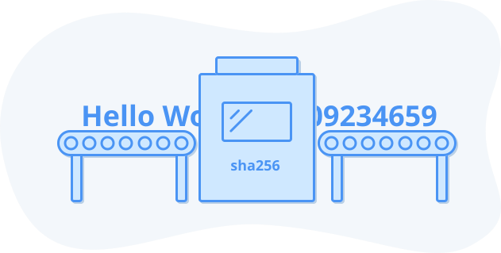
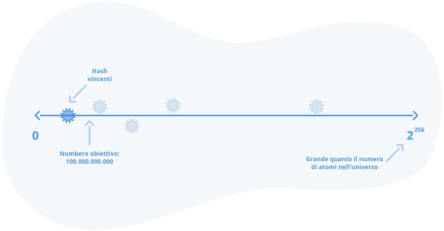

## Prova di lavoro

Il sistema della lotteria, così come è stato progettato finora, presenta due problemi principali:

1.  Chi venderà i biglietti della lotteria e sceglierà i numeri vincenti, se abbiamo già stabilito che non possiamo avere alcun tipo di soggetto centrale fidato? 
2.  Come facciamo a garantire che il vincitore della lotteria scriva effettivamente nel libro mastro le transazioni corrette, senza cercare di imbrogliare tutti gli altri?

Se vogliamo un sistema *senza permessi* a cui chiunque possa aderire, allora dobbiamo rimuovere dal sistema la dipendenza dalla fiducia e rendere il nostro sistema *senza fiducia*:

1.  Tutti devono poter generare il proprio biglietto della lotteria, dal momento che non possiamo fidarci di un'autorità centrale. I sistemi di lotteria centralizzati standard, come il Superenalotto, sono gestiti da qualcuno che genera una serie di biglietti con numeri casuali. Poiché non possiamo fare affidamento su un'autorità centrale, dobbiamo permettere a chiunque di generare i numeri dei propri biglietti.
2.  Dobbiamo trovare un modo per far sì che giocare alla lotteria abbia un costo, in modo da evitare che qualcuno monopolizzi la lotteria generando un numero enorme di biglietti gratuitamente. Come possiamo fare in modo che si debbano spendere soldi per comprare i biglietti quando non c'è nessuno da cui comprarli? Li faremo comprare dall'universo consumando elettricità, una risorsa costosa.
3.  Per tutti gli altri partecipanti, dev'essere facile verificare la vincita della lotteria solo esaminando il biglietto. Nel Superenalotto, gli organizzatori della lotteria generano la combinazione vincente. Poiché questo non è possibile in un sistema decentralizzato, possiamo fare in modo che tutti si accordino in anticipo su un intervallo di numeri e che, se il numero della lotteria rientra in questo intervallo prestabilito, venga assegnata la vincita della lotteria. Per farlo useremo un espediente crittografico chiamato funzione di hash.

### Prova di lavoro: un puzzle asimmetrico ad alta intensità energetica

La soluzione elegante a tutti e tre questi problemi si chiama Prova di Lavoro. In realtà [è stata inventata molto prima di Bitcoin, nel 1993](https://it.wikipedia.org/wiki/Proof-of-work). La spiegazione completa di come funziona questa lotteria è probabilmente la cosa più difficile da capire di Bitcoin, quindi dedicheremo i prossimi capitoli a trattare la soluzione in modo approfondito.

Dobbiamo rendere costoso "acquistare i biglietti" della lotteria, altrimenti le persone riuscirebbero a generare un numero illimitato di biglietti. Quale soluzione è in grado di garantire un costo elevato, ma senza dipendere da un'autorità centrale?

È qui che, per Bitcoin, entra in gioco la fisica: la prima legge della termodinamica dice che l'energia non può essere né creata né distrutta. In altre parole, non esistono pranzi gratis quando si ha a che fare con l'energia. L'elettricità è sempre costosa perché bisogna acquistarla dai produttori di energia o possedere una propria fonte di energia elettrica. In entrambi i casi, ottenere elettricità è costoso.

Il concetto alla base della Prova di lavoro è che si partecipa a un processo casuale, simile al lancio di un dado. Ma invece di sei facce, il dado ha tante facce quanti sono gli atomi dell'universo. Per lanciare il dado e generare i numeri della lotteria, il tuo computer deve eseguire operazioni che producono un costo in termini di elettricità.

Per vincere la lotteria, è necessario produrre un numero che deriva matematicamente dalle transazioni che si desidera scrivere sul libro mastro, aggiungendo il valore del dado lanciato. Per trovare questo numero vincente, è possibile che si debba lanciare il dado miliardi, trilioni o quadrilioni di volte, consumando migliaia di euro di energia. Poiché il processo si basa sulla casualità, è possibile per chiunque generare i propri biglietti della lotteria senza un'autorità centrale, utilizzando solo un computer che genera numeri casuali ed un elenco di transazioni che si desidera scrivere sul libro mastro. 

Anche se ti sono serviti migliaia di euro per consumare l'energia sufficiente a trovare un numero casuale vincente, tutti gli altri utenti della rete devono eseguire solo alcuni controlli di base per convalidare la tua vincita:

1.  Il numero fornito è inferiore all'intervallo di numeri precedentemente concordato come obiettivo da tutti i partecipanti?
2.  Il numero è effettivamente derivato matematicamente dall'insieme valido di transazioni che si desidera scrivere sul libro mastro?
3.  Le transazioni presentate sono valide in base alle regole di Bitcoin: non ci sono doppie spese, non si generano nuovi Bitcoin al di fuori del programma di emissione prestabilito, ecc.

La prova di lavoro è un processo casuale che richiede molti calcoli per trovare un numero vincente. Tuttavia, è sufficiente una sola operazione per verificare la soluzione. Pensate a un cruciverba o a un sudoku. Può richiedere molto tempo per essere risolto, ma chiunque abbia a disposizione le risposte e gli indizi può convalidarlo rapidamente. Questo rende il sistema della prova di lavoro *asimmetrico*: è difficile per i giocatori, ma facile per i validatori.

Poiché hai consumato una notevole quantità di energia, e quindi di denaro, giocando a questa lotteria, desideri che tutti accettino il tuo biglietto vincente. Pertanto, sei incentivato a comportarti bene, scrivendo nel libro mastro solo transazioni valide.

Se, ad esempio, cerchi di spendere denaro che è già stato speso, il tuo biglietto "vincente" della lotteria sarà rifiutato da tutti gli altri e perderai tutto il denaro che hai speso per comprare l'energia da consumare per il biglietto. D'altra parte, se scrivi transazioni valide nel libro mastro, ti ricompenseremo in bitcoin in modo che tu possa pagare le tue bollette energetiche e conservare un po' di profitto.

Il sistema della Prova di Lavoro ha l'importante proprietà di essere *costoso nel mondo reale*. Pertanto, se volessi attaccare la rete facendo pressione su alcuni dei suoi partecipanti, non dovresti solo andare a casa loro e impossessarti del loro computer, ma dovresti anche pagare le loro bollette elettriche. 

Come fanno i partecipanti a dimostrare di aver consumato questa energia? È necessario un rapido ripasso di informatica su due concetti: *hashing* e *bit*.

### Hashing

Il puzzle asimmetrico della prova di lavoro di Bitcoin prevede l'utilizzo di una [*funzione di hash*](https://it.wikipedia.org/wiki/Funzione_di_hash) (N.d.T.: dal verbo inglese *to hash*: sminuzzare, pasticciare). Grazie all'algebra di base, sappiamo che una funzione è una scatola in cui si inserisce un *input* pari ad *x* e si ottiene un *output* pari a *f(x)*. Ad esempio, la funzione *f(x)=2x* prende un valore e lo moltiplica per due. Quindi l'input *x=2* ci dà l'output *f(x)=4*. 

Una funzione hash è una funzione speciale in cui si inserisce una qualsiasi stringa di lettere, numeri o altri dati, come "Hello world", e si ottiene un numero gigantesco dall'aspetto casuale:

> 86991366044392467661783165166973309023807181648024718778313526389892860994842

La particolare funzione di hash che ho utilizzato per l'hash di "Hello world" si chiama [sha256](https://en.wikipedia.org/wiki/SHA-2) e si dà il caso che sia quella utilizzata da Bitcoin.

*I dati entrano da una parte, dall'altra escono numeri giganteschi e imprevedibili.

La funzione di hash sha256 ha le seguenti proprietà che ci risultano utili:

1.  L'output è deterministico: si ottiene sempre lo stesso output per lo stesso input.
2.  L'output è imprevedibile: cambiando una sola lettera o aggiungendo uno spazio alla stringa di input, l'output cambia drasticamente, tanto che non è possibile trovare alcuna correlazione con l'input originale.
3.  Il calcolo dell'hash è rapido a prescindere dalla dimensione dei dati in ingresso.
4.  È impossibile trovare due stringhe che abbiano lo stesso risultato.
5.  Dato l'hash di uscita di sha256, è impossibile risalire alla stringa di ingresso. Si tratta di una funzione unidirezionale.
6.  L'output ha sempre una dimensione specifica (256 *bits* nel caso dello sha256).

### Un rapido accenno ai bit

Il sistema numerico che conosci e ami, composto dai numeri da 0 a 9, si chiama *decimale* perché ha dieci cifre. I computer, invece, preferiscono un sistema numerico diverso, fatto di uno e zero, che indica la presenza o l'assenza di un segnale elettrico. Questo sistema numerico è chiamato *binario*. 

Nel sistema decimale, si utilizzano solo le *cifre* da 0 a 9. Se si usa una sola cifra, si possono rappresentare dieci numeri diversi, da 0 a 9. Se si usano due cifre, si possono rappresentare dieci numeri diversi. Se si usano due cifre, si possono rappresentare 10 x 10 = 100 numeri diversi: 00, 01, ... fino a 99. Con tre cifre, si possono avere 10 x 10 x 10 = 1000 numeri: 000, 001, ... fino a 999.

Spero che si cominci ad intravedere la presenza di uno schema. Per capire quanto è grande un numero che possiamo rappresentare con N cifre, moltiplichiamo dieci per se stesso N volte, in altre parole 10^N^, o 10 alla potenza di N.

Il sistema binario funziona allo stesso modo. L'unica cosa che cambia è il numero di cifre a nostra disposizione. Anche se siamo abituati al decimale con dieci cifre, una *cifra binaria* o *bit* può avere solo due valori: zero e uno.

Se 1 bit può rappresentare due valori, allora due bit possono rappresentare 4 valori: 00, 01, 10, 11. È possibile calcolare questo valore moltiplicando 2 x 2, poiché ogni cifra può avere due valori. 

Tre bit possono rappresentare 2 x 2 x 2 = 2^3^ = 8 valori, che sono 000, 001, 010, 011, 100, 101, 110, 111.

Un numero *binario* lungo N *bit* può rappresentare 2^N^ valori diversi.

Pertanto, il numero di valori unici che si possono rappresentare con 256 bit, ossia la dimensione della funzione di hashing sha256, è 2^256^. È un numero enorme, quasi inconcepibile. Rappresentato in decimale, questo numero è lungo 78 cifre. Per metterlo in prospettiva, è pari al numero stimato degli atomi presenti nell'universo conosciuto.

> 2^256^ = 115,792,089,237,316,195,423,570,985,008,687,907,853,269,984,665,640,564,039,457,584,007,913,129,639,936

Questo è il numero di risultati possibili quando si esegue l'hash di qualsiasi stringa con la funzione di hash sha256. Pertanto, è effettivamente impossibile prevedere quale sarà il numero prodotto da questa funzione. Sarebbe come prevedere 256 lanci di fila di una moneta o indovinare la posizione di un atomo specifico che ho scelto da qualche parte nell'universo.

Questo numero è troppo lungo per continuare a scriverlo, quindi d'ora in poi diremo solo 2^256^, ma spero che questo susciti in te l'immagine mentale di un universo di possibilità.

### Facciamo l'hash di alcune stringhe

Ecco alcune stringhe di esempio e i loro hash sha256. Ho mostrato il loro output come numeri decimali, anche se all'interno di un computer questi appaiono come una stringa binaria composta da numeri uno e zeri.

Lo scopo è dimostrare come il numero cambi drasticamente in seguito ad una piccola modifica della stringa di input. Non è possibile prevedere l'output prodotto dalla funzione hash in base a ciò che è stato inserito:

> Hello world!
> 86991366044392467661783165166973309023807181648024718778313526389892860994842

> Hello world!!
> 84940227720695898955447627108840424364390283616735576803008868844073193772558

Non c'è modo per nessuno, nemmeno per un computer, di guardare il numero casuale risultante e capire la stringa che lo ha creato. Se volete giocare con sha256, potete provarlo su [[https://passwordsgenerator.net/sha256-hash-generator](https://passwordsgenerator.net/sha256-hash-generator/).

### Hashing per vincere la lotteria della prova di lavoro

Ora siamo pronti a parlare del momento chiave della magia. Abbiamo detto che ci sono 2^256^ possibili valori di output sha256. Per agevolare la comprensione, facciamo finta che ci siano solo 1000 possibili valori di uscita dell'hash. 

Il sistema della lotteria funziona in questo modo:

1.  Alice annuncia di voler inviare 2 euro a Bob.
2.  Chiunque giochi alla lotteria prende questa transazione "Alice dà 2 euro a Bob", aggiungendo alla fine un numero casuale chiamato *nonce* (numero usato una sola volta). Questo serve ad assicurarsi che la stringa che stanno *hashando* sia diversa da quella di chiunque altro, aiutandoli a trovare il numero vincente della lotteria.
3.  Se il numero è inferiore al *numero obiettivo* (di cui parleremo nel prossimo capitolo), vincono la lotteria.
4.  Se il numero ottenuto è più grande del Numero Obiettivo, allora si fa di nuovo l'hash, aggiungendo altri nonce casuali: "Alice dà 2 euro a Bob nonce=12345", poi "Alice dà 2 euro a Bob nonce=92435", poi "Alice dà 2 euro a Bob nonce=132849012348092134", e così via, finché il numero di hash risultante è più piccolo del numero obiettivo.

Potrebbero essere necessari molti, molti tentativi per trovare un hash inferiore al numero target. Possiamo infatti controllare la frequenza con cui qualcuno può vincere alla lotteria controllando la probabilità che trovi un numero vincente. Se ci sono 1000 hash possibili e impostiamo il numero target a 100, quale percentuale di hash è inferiore al target?

Questa è matematica di base: 100 su 1000 numeri possibili o 100/1000 = 10% degli hash sono inferiori all'obiettivo. Quindi, se si esegue l'hash di una stringa qualsiasi e la funzione hash produce 1000 risultati diversi, ci si aspetta di ottenere un hash inferiore all'obiettivo di 100 circa il 10% delle volte.

La lotteria funziona così: ci accordiamo su un numero obiettivo, poi prendiamo tutte le transazioni che ci vengono segnalate e le sottoponiamo alla funzione di hash, aggiungendo un nonce casuale alla fine. Una volta che qualcuno trova un hash inferiore al valore obiettivo, lo annunciamo a tutti i membri della rete:

Ciao a tutti:

- Ho preso le transazioni: "Alice invia 2 euro a Bob, Carlotta invia 5 euro ad Alice".
- Ho aggiunto il nonce "32895".
- Il risultato è stato un output di hash pari a 42 che è inferiore all'obiettivo di 100.
- Ecco la mia prova di lavoro: i dati della transazione, il nonce che ho usato e l'hash prodotto sulla base di questi input.

Potrei aver impiegato miliardi di tentativi di hashing per arrivare a questo punto, consumando migliaia di euro di energia, ma tutti gli altri possono immediatamente convalidare che ho effettivamente eseguito questo lavoro.

Poiché ho fornito loro sia i dati di input (transazioni e nonce) sia l'output previsto (il numero di hash), gli altri possono eseguire lo stesso hash in un solo tentativo e verificare se ho effettivamente fornito loro i dati corretti.

Possiamo pensare all'hashing come al lancio di un dado gigante che produce numeri da zero al numero di atomi dell'universo in base ai dati di input, che si compongono delle transazioni. Solo gli hash inferiori al numero obiettivo vincono la lotteria e bisogna dimostrare quali dati sono stati utilizzati per produrre l'hash.

Come si collega tutto questo al consumo di energia? Abbiamo già detto che l'insieme di tutti gli hash possibili è in realtà un numero gigantesco, grande quanto il numero di atomi dell'universo. Ora possiamo impostare l'obiettivo in modo che solo una piccola frazione di hash sia valida. Ciò significa che chiunque voglia trovare un hash valido dovrà spendere un'enorme quantità di tempo di calcolo, e quindi di elettricità, per trovare un numero di hash più piccolo del nostro obiettivo.

Più piccolo è l'obiettivo, più tentativi saranno necessari per trovare un numero valido. Più grande è l'obiettivo, più velocemente possiamo trovare un hash vincente. Se le probabilità di centrare l'obiettivo sono di un milione a 1, dimostrando di averlo centrato, proviamo di aver eseguito circa un milione di calcoli.

