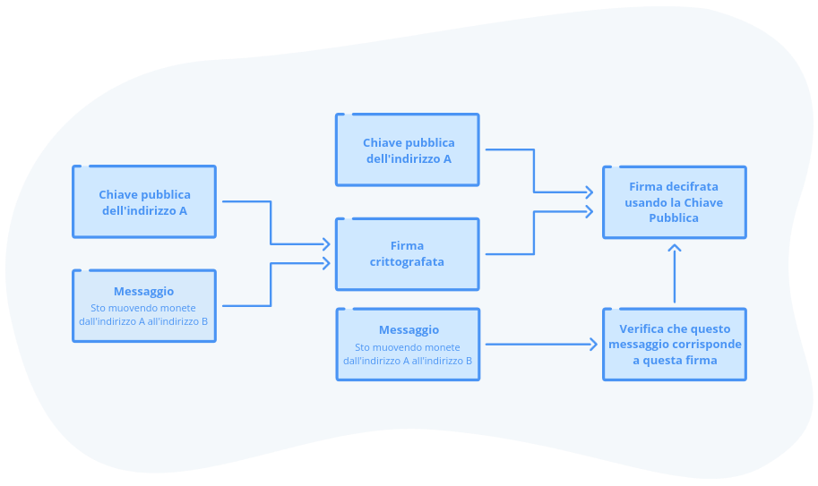
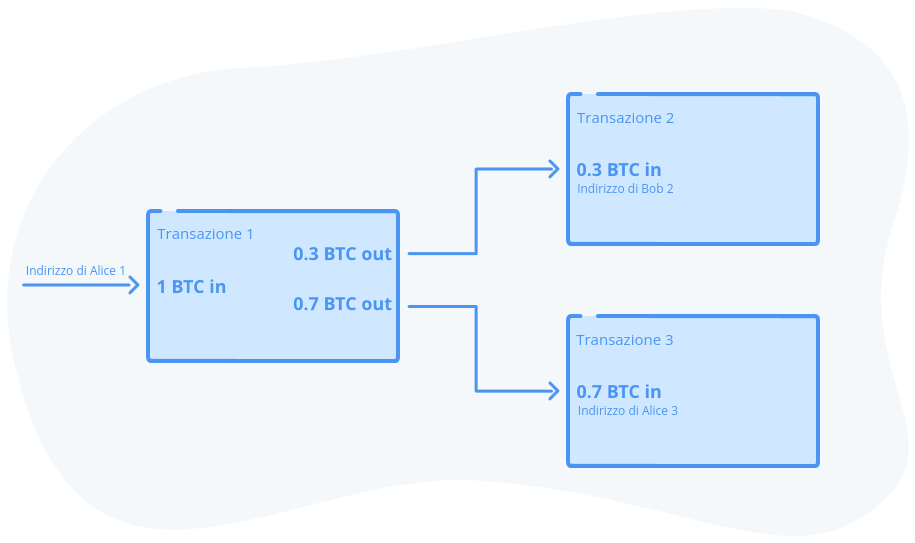

## Conti senza identità

Abbiamo costruito un libro mastro distribuito senza autorità centrale, un sistema di mining basato su una lotteria per selezionare chi può scriverlo, un metodo per premiare i minatori virtuosi e punire quelli che si comportano male, un meccanismo per regolare la difficoltà del mining in modo da garantire un programma di emissione affidabile nel tempo e ridurre i conflitti, ed un sistema per verificare la validità della catena attraverso la prova di lavoro cumulativa e la cronologia delle transazioni.

Ora occupiamoci dell'identità. In un sistema bancario tradizionale, l'invio di denaro avviene identificandosi presso la banca. Si presenta un documento d'identità o un codice pin al bancomat, oppure si digitano un nome utente e una password in un'applicazione. La banca si assicura che non ci siano due entità collegate alla stessa identità.

Dato che ora non abbiamo alcuna autorità centrale che tenga traccia delle identità, come possiamo aprire conti nel nostro nuovo sistema finanziario basato su Bitcoin? Come possiamo raggiungere l'obiettivo di Satoshi di eliminare l'identità dalle transazioni finanziarie, per evitare il furto di identità e l'affidamento delle nostre informazioni ad entità centrali? Come possiamo garantire che quando Alice annuncia di voler pagare Bob, sia davvero lei e che abbia il diritto di spostare quei fondi?

### Apertura di un "conto Bitcoin"

Non possiamo affidarci ad un intermediario centrale come una banca per gestire un registro di tutti i conti. E se lasciassimo ad ognuno la possibilità di registrare il proprio nome utente e la propria password? Una banca normalmente controllerebbe che un nome utente non sia già in uso, ma questo non è possibile nel nostro scenario, poiché non abbiamo un attore centrale che distribuisce le identità. Abbiamo bisogno di qualcosa di più grande, più forte e più unico di un nome utente e di una password. Questa possibilità dovrebbe essere già nota dai capitoli precedenti. Ancora una volta, abbiamo bisogno di un numero casuale gigante.

Così come abbiamo reso possibile a tutti l'acquisto di biglietti della lotteria generando dei grandi numeri casuali, possiamo usare lo stesso espediente per generare i conti. Per creare un "conto Bitcoin", noto anche come *indirizzo*, genereremo prima una coppia di numeri a 256 bit matematicamente collegati, nota come *coppia di chiave pubblica/privata*. È bene tenere a mente che un numero di 256 bit è grande all'incirca quanto il numero di atomi dell'universo conosciuto, quindi è praticamente impossibile che due persone generino accidentalmente la stessa coppia di chiavi. Daremo il nostro indirizzo a chiunque voglia inviarci monete. Useremo la chiave privata per spendere le monete. Ecco come funziona.

La crittografia è un metodo per prendere alcuni dati e oscurarli, in modo che solo chi possiede la chiave possa leggere il messaggio originale decrittandolo. Da bambini, alcuni di noi hanno giocato con giocattoli di base per la codifica/decodifica che utilizzavano una chiave per trasformare un messaggio in un testo incomprensibile e viceversa. Questo tipo di crittografia è detta simmetrica ed utilizza una sola chiave. Il sistema a coppia di chiavi pubbliche/private è *asimmetrico* perché si può criptare con una chiave e decriptare con l'altra.

Puoi condividere la tua chiave pubblica con tutto il mondo. Le persone che vogliono inviarti messaggi possono crittografarli con la tua chiave pubblica. Dal momento che solo tu possiedi la chiave privata, sei l'unico a poterli decifrare.

Osserviamo come Alice invia le monete a Bob. Per ricevere una transazione, Bob genera una coppia di chiavi e mantiene segreta la sua chiave privata. Produce un *indirizzo*, ovvero un numero enorme basato su un hash della sua chiave pubblica. Bob condivide poi il numero del suo indirizzo con Alice.

Si può pensare all'indirizzo come a una cassetta della posta. Al posto delle lettere, Alice può inserire delle monete in questa cassetta postale. Ma solo Bob possiede la chiave privata che apre la cassetta postale per spendere le monete.

Quando si sposta del denaro in banca, si forniscono il nome utente e la password. Quando si emettono assegni, si firma con il proprio nome per certificare che si sta emettendo l'assegno. Quando si spostano bitcoin, si fornisce la prova di possedere la chiave dell'indirizzo che contiene le monete.

Alice deve dimostrare di possedere la chiave privata della sua cassetta postale a chiave pubblica, ma non vuole esporre la sua chiave privata agli hacker, che altrimenti potrebbero derubarla e utilizzare la sua cassetta postale per i loro acquisti.

La prova di Alice della proprietà della chiave è chiamata *firma digitale*. Alice costruisce una transazione, che è essenzialmente un pezzo di dati che assomiglia a questo:

> L'indirizzo 12345, che contiene 2,5 bitcoin, invia 2 bitcoin all'indirizzo 56789 e 0,5 bitcoin all'indirizzo 12345.

In realtà, i numeri degli indirizzi sono numeri giganti a 160 bit. In seguito, Alice cripta la stessa transazione con la sua chiave privata, creando una *firma digitale*.

Quando annuncia la transazione agli altri nodi della rete, rivela la chiave pubblica della cassetta postale da cui sta inviando i fondi e la firma crittografata con la chiave privata. Alice dichiara quanto segue:

- Sto inviando monete dall'indirizzo 12345
- Ecco la chiave pubblica dell'indirizzo 12345; si può vedere che è effettivamente la chiave pubblica facendo l'hashing della chiave pubblica e vedendo che si ottiene tale indirizzo.
- Ecco una firma che ho criptato con la chiave privata corrispondente a questo indirizzo. È possibile utilizzare la chiave pubblica per decifrarla e verificare che è identica a quella dei dati della transazione che sto inviando.

*La transazione che sposta le monete viene crittografata utilizzando la chiave privata per creare una firma digitale. Viene decifrata usando la chiave pubblica, che tutti conoscono.

Poiché ora tutti conoscono la chiave pubblica di Alice per la sua cassetta postale, chiunque può facilmente decifrare la firma digitale. Essendo in grado di decifrare correttamente la firma utilizzando la chiave pubblica dell'indirizzo, tutti sanno che Alice deve aver utilizzato la chiave privata di quell'indirizzo per creare la firma. Altrimenti, la decifrazione sarebbe fallita, poiché la chiave pubblica può decifrare solo i messaggi crittografati con la chiave privata corrispondente. Ma soprattutto, nessuno conosce la sua chiave privata, bensì solo la prova che è stata in grado di usarla per crittografare la sua firma.

A differenza della firma su un assegno o della password bancaria, la firma digitale è specifica per i dati unici della transazione che si sta firmando. Non può quindi essere rubata e riutilizzata per un'altra transazione. Ogni transazione riceve una firma diversa, anche se viene inviata dallo stesso indirizzo pubblico e con la stessa chiave privata, poiché ogni nuovo dato della transazione cambia l'hash della firma.

### Puoi indovinare una chiave privata?

Calcoliamo le probabilità di indovinare una chiave privata, che ti darebbe la possibilità di spostare le monete dell'indirizzo pubblico corrispondente. Ricordiamo che una chiave è composta da 256 bit. Ogni bit ha solo due valori (uno o zero). Ciò significa che possiamo considerare ogni bit come il risultato del lancio di una moneta. 

Se avessimo una chiave privata di 1 bit, sarebbe come lanciare una singola moneta. Testa o croce? Uno o zero? Hai una probabilità su due di indovinare. Breve ripasso di statistica di base: la probabilità che si verifichino più eventi viene calcolata moltiplicando insieme le singole probabilità di ciascun evento. Se il lancio di una moneta ha una probabilità di dare testa pari a 1/2, la probabilità che due lanci di fila diano testa è pari a 1/2 x 1/2 = 1/4 o 1 su 4.

La probabilità di indovinare l'esito di 8 lanci di fila di una moneta è pari a 2^8^, ovvero una su 256.

Una targa ha sei lettere e numeri. Ci sono 26 lettere e 10 numeri, per un totale di 36 caratteri. Il numero di targhe possibili è 36^6^, quindi le probabilità di indovinare una targa sono una su due miliardi[^1]. Una carta di credito è composta da sedici cifre. Ogni cifra può avere 10 valori e ce ne sono 16, quindi le probabilità di indovinare una carta di credito sono una su 10^16^, cioè una su 10.000.000.000.000.000 o circa una su dieci quadrilioni.

Sulla Terra ci sono circa 10^50^ atomi. Se sto pensando ad un atomo scelto a caso, le probabilità che hai di indovinarlo sono circa:

> Una su 1.000.000.000.000.000.000.000.000.000.000.000.000.000.000.000.000.000.000.000.000.

Una chiave privata ha 256 bit, ovvero 2^256^ o circa 10^77^. Indovinare l'intera chiave sarebbe paragonabile a indovinare un atomo specifico dell'intero universo conosciuto oppure a vincere il Superenalotto per 9 volte di seguito:

> Una possibilità su 115.792.089.237.316.195.423.570.985.008.687.907.853.269.984.665.640.564.039.457.584.007.913.129.639.936

Ma cosa accadrebbe se avessi un computer super potente per provare ad andare per tentativi?  Non posso rendere giustizia a questo argomento più di quanto non faccia [il post su Reddit all'indirizzo https://bit.ly/2Dbw9Qd](https://bit.ly/2Dbw9Qd), che ti consiglio di leggere per intero. Sebbene sia molto tecnico, il paragrafo finale rende bene l'idea di cosa si dovrebbe fare per elencare tutte le possibili chiavi a 256 bit:

> *"Quindi, se si potesse usare l'intero pianeta come disco rigido, memorizzando 1 byte per ogni atomo, usando le stelle come combustibile e provando 1 trilione di chiavi al secondo, servirebbero 37 ottilioni di Terre per memorizzarle e 237 miliardi di stelle per alimentare il dispositivo in grado di farlo, e tutto ciò richiederebbe 3,6717 ottilioni di anni "*.
> 
> u/PSBlake su r/Bitcoin

In pratica, è impossibile indovinare la chiave privata di qualcuno. Non solo, ma il numero di possibili indirizzi Bitcoin è così elevato che si consiglia di generare un nuovo indirizzo con una nuova chiave privata per ogni transazione effettuata. Quindi, al posto di un solo conto bancario, potresti avere migliaia o addirittura milioni di conti Bitcoin, uno per ogni transazione che avrai mai ricevuto. 

Può essere sconcertante che il tuo conto Bitcoin sia protetto solo dal caso, ma spero che la spiegazione di cui sopra renda l'idea che questo sistema è molto più sicuro della password del tuo conto bancario, memorizzata su un server centralizzato e a disposizione degli hacker.

### Tracciamento dei bilanci

È giunto il momento di correggere un'ultima bugia a fin di bene che abbiamo ripetuto nei capitoli precedenti. In realtà non libro mastro non sono registrati dei bilanci. Al contrario, Bitcoin utilizza un modello chiamato UTXO: dall'inglese Unspent Transaction Outputs (N.d.T.: esiti di transazione non spesi). L'esito di transazione non speso indica le monete ricevute con una transazione precedente, provenienti da qualcuno che te le ha inviate o emesse da una transazione *coinbase*.

A differenza delle monete metalliche, che possono avere tagli specifici come dieci centesimi, venticinque centesimi e così via, i bitcoin sono divisibili in 100.000.000 di unità chiamate satoshi. Pertanto, a seconda dei tagli ricevuti sui propri indirizzi, potrebbe essere necessario combinare le monete di più indirizzi o dividere un UTXO più grande per trasformarlo in altri più piccoli da inviare a qualcun altro. È come inviare un mucchio di monete a una macchina che le fonde e ne conia di nuove di qualsiasi taglio. I *wallet*, di cui si parlerà più avanti in questo capitolo, in genere gestiscono tutto questo dietro le quinte, in modo che all'utente basti specificare l'importo che desidera inviare.

Supponiamo che Alice abbia un indirizzo che contiene 1 bitcoin. Vuole inviare 0,3 bitcoin a Bob. Alice genera una transazione che mostra il suo indirizzo con una UTXO da 1 bitcoin come input e due output: una nuova UTXO da 0,3 bitcoin verso l'indirizzo di Bob e una nuova UTXO da 0,7 bitcoin per un suo indirizzo, come resto. Il resto può essere inviato all'indirizzo di invio originale o, per una maggiore privacy, può essere inviato ad un nuovo indirizzo generato al volo.

*Se non si dispone di un UTXO dell'importo esatto che si desidera inviare, se ne dividerà uno per creare il resto. Si possono anche combinare più UTXO per creare un nuovo UTXO più grande.

Osservando la block chain, non c'è modo di sapere chi controlla un determinato indirizzo. Per farlo, è necessario conoscere le chiavi private corrispondenti e collegarle alle identità del mondo reale. Il modello UTXO incoraggia un meccanismo di privacy molto interessante, inviando le monete ad un nuovo indirizzo ogni volta che vengono spostate. Pertanto, una persona che ha inviato o ricevuto monete molte volte, può possedere centinaia o migliaia di indirizzi. Il software del wallet gestisce tutto questo per noi, quindi non dobbiamo preoccuparci dei tecnicismi.

Quindi, per verificare il "saldo" di un particolare indirizzo, dobbiamo sommare tutti gli UTXO che hanno questo indirizzo come uscita. L'insieme degli UTXO attualmente presenti in Bitcoin cresce quando le persone inviano monete da un indirizzo a molti altri, e si riduce quando le persone effettuano transazioni di "consolidamento", in cui le monete di molti indirizzi vengono messe in un unico indirizzo. 

Il modello UTXO consente di individuare in modo semplice ed efficiente le doppie spese, poiché ogni UTXO può essere speso una sola volta. Per farlo, non abbiamo bisogno di conoscere l'intera storia delle spese effettuate da un particolare conto.

Possiamo anche creare e distruggere un numero qualsiasi di UTXO contemporaneamente, creando transazioni complesse che mescolano diversi input e output. Ciò consente l'implementazione di CoinJoin[^2], in cui più parti partecipano ad un'unica transazione Bitcoin che mescola un numero qualsiasi di input per produrre un numero qualsiasi di output, oscurando così la storia degli UTXO dei partecipanti. La popolarità di queste tecniche è in aumento ed è importante per la privacy e la *fungibilità*, termine che indica che un bitcoin qualunque è del tutto equivalente a qualsiasi altro bitcoin. In questo modo, se alcuni bitcoin passano per le mani di persone poco raccomandabili, non vengono contaminati per l'eternità solo perché sono stati usati una volta per qualcosa di malevolo.

### Wallet

La creazione di un conto non è altro che la generazione di una coppia di chiavi casuali a 256 bit. Possiamo creare migliaia o milioni di account, quindi abbiamo bisogno di un modo per tracciarli. In Bitcoin, la parola *wallet* è usata per indicare qualsiasi tipo di dispositivo che tenga traccia delle chiavi (N.d.T.: motivo per cui alcuni preferiscono tradurlo come *portachiavi* anziché *portafoglio* Bitcoin). Il wallet può essere semplice come un pezzo di carta o complesso come un dispositivo hardware.

Il codice iniziale di Bitcoin rilasciato da Satoshi era dotato di un wallet software. Questo wallet generava gli indirizzi, memorizzava le chiavi e selezionava gli UTXO da spendere, in modo da poter inviare facilmente bitcoin di qualsiasi taglio.

A differenza del conto che hai presso la tua banca, che di solito ha la forma di un'applicazione mobile o web prodotta dalla tua banca, Bitcoin è un sistema completamente aperto. Esistono quindi decine di wallet, la maggior parte dei quali gratuiti, molti dei quali sono anche open source, oltre ad una mezza dozzina di implementazioni di hardware wallet (e altri in arrivo). Chiunque abbia competenze di programmazione informatica può costruire il proprio wallet o leggere il codice di un wallet open source per assicurarsi che non contenga nulla di losco.

Poiché la chiave privata è l'unica cosa di cui hai bisogno per spendere le tue monete, devi custodirla molto attentamente. Se qualcuno ruba la tua carta di credito, puoi chiamare la società emittente e sporgere una denuncia per frode, in modo da cercare di riavere i tuoi soldi. In Bitcoin non c'è alcun intermediario. Se qualcuno ottiene la tua chiave privata, controlla le tue monete e non c'è nessuno che potrà aiutarti a recuperarle.

Le chiavi private sono anche soggette a perdita. Se si memorizza il wallet sul proprio computer e questo viene rubato o prende fuoco, è un problema. Se si seguono le migliori pratiche di Bitcoin, che prevedono la generazione di un nuovo indirizzo ogni volta che si ricevono pagamenti, la conservazione sicura e il backup di queste chiavi private diventano in poco tempo un'operazione piuttosto onerosa.

Nel corso del tempo, l'ecosistema Bitcoin ha sviluppato una serie di soluzioni a questo problema. Nel 2012 è stato proposto [BIP32](https://github.com/bitcoin/bips/blob/master/bip-0032.mediawiki) (Bitcoin Improvement Proposal, un meccanismo per diffondere idee su come migliorare Bitcoin) per generare dei wallet deterministici gerarchici. L'idea di fondo è che, utilizzando un solo numero casuale chiamato *seed* (N.d.T.: in inglese, seme), si possano generare continuamente molte coppie di chiavi che rappresentano gli indirizzi bitcoin e le relative chiavi private.

Al giorno d'oggi, attraverso i wallet software o hardware comunemente disponibili, vengono generate automaticamente nuove chiavi per ogni transazione, consentendo all'utente di eseguire il backup di una sola *master key* (N.d.T: in inglese, chiave principale).

Nel 2013 è stato introdotta la [BIP39](https://github.com/bitcoin/bips/blob/master/bip-0039.mediawiki) per rendere ancora più semplice il backup delle chiavi. Invece di utilizzare un numero casuale, le chiavi vengono generate da un insieme casuale di parole leggibili dall'uomo (N.d.T.: solitamente 12 o 24 parole inglesi). Ecco un esempio di seed BIP39:

> witch collapse practice feed shame open despair creek road again ice least

Con questo metodo, il backup delle chiavi è diventato molto semplice: si può scrivere il *seed* su un pezzo di carta e metterlo in una cassetta di sicurezza. Si può persino memorizzare la frase e fuggire da un regime economico in crisi come quello venezuelano senza nulla addosso, senza che nessuno si accorga che si sta portando nella propria testa tutta la nostra ricchezza.

Inoltre, per accedere ad un indirizzo Bitcoin può essere necessaria più di una chiave privata. Gli indirizzi a firma multipla o *multisig* possono utilizzare una grande varietà di schemi di sicurezza. Ad esempio, due persone possono condividere un conto utilizzando un multisig 1 su 2, in cui entrambe le parti possono firmare per le transazioni e spendere monete.

Un multisig 2 su 2, che richiede ad entrambe le parti di fornire la propria chiave per spendere, può essere usato per impedire ad una singola persona di ottenere il controllo di un conto, ad esempio tra partner commerciali.

È possibile creare un semplice sistema di deposito a garanzia utilizzando un sistema multisig 2 su 3. L'acquirente riceve una chiave, il venditore una seconda chiave ed una terza chiave è fornita ad un mediatore. Se l'acquirente e il venditore sono d'accordo, possono muovare i fondi insieme. In caso di controversia, il mediatore può agire di concerto con una delle parti per sbloccare i fondi.

È possibile utilizzare uno schema multisig 3 su 5 per proteggersi dalla perdita delle chiavi, concedendosi di perdere fino a 2 delle 5 chiavi e di essere comunque in grado di sbloccare i fondi. È possibile conservare due delle chiavi in luoghi diversi, due presso amici fidati che non si conoscono e una presso un servizio di custodia specializzato come BitGo che co-firma le transazioni, rendendo i propri bitcoin molto difficili da rubare e proteggendosi dalla perdita delle chiavi.

Si può persino andare oltre e creare indirizzi che vengono sbloccati da condizioni alquanto complesse utilizzando costrutti di programmazione come le dichiarazioni condizionali ("se questo, allora quello"). Potreste persino bloccare le monete in un indirizzo che sarà accessibile solo tra 10 anni, e nemmeno voi, in quanto creatori di tale indirizzo, potrete modificare il codice per spendere quelle monete prima del tempo.

Sempre più soluzioni di custodia parziale stanno nascendo da aziende come Casa e Unchained Capital, che aiutano a conservare le chiavi in modo sicuro. A differenza di una banca, che può bloccare il vostro conto, queste soluzioni fungono da backup o da co-firmatario di fiducia, ma non possono prendere i vostri fondi senza le vostre chiavi. Il software dei wallet è in continua evoluzione perché non richiede l'autorizzazione di nessuno, a differenza dell'app della banca. Per questo motivo vediamo nascere sempre più nuovi operatori e più innovazione.

Si tratta di un fenomeno profondo e di portata mondiale. Mai prima d'ora è stato possibile detenere o muovere il proprio patrimonio proteggendolo completamente da sequestri o furti.

***
[^1]: L'ispirazione per questa sezione è venuta da un eccellente post di Medium che illustra in dettaglio le probabilità di una serie di eventi. Raccomando di leggere l'intero post per capire il contesto: <https://medium.com/@kerbleski/a-dance-with-infinity-980bd8e9a781>

[^2]: <https://en.bitcoin.it/wiki/CoinJoin>

