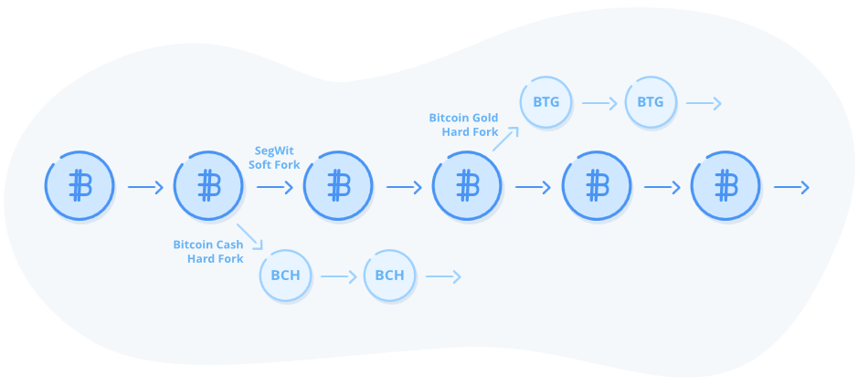

## Chi fa le regole?

Abbiamo ottenuto un sistema distribuito in grado di tenere traccia del valore e di trasferirlo. Rivediamo ciò che abbiamo costruito finora:

1.  Un libro mastro distribuito, una copia del quale è conservata da ogni partecipante.
2.  Un sistema di lotteria basato sulla prova di lavoro e su aggiustamenti di difficoltà per mantenere la rete al riparo da manomissioni e assicurare la coerenza del programma di emissione della moneta.
3.  Un sistema di consenso che garantisce che ogni partecipante possa convalidare l'intera storia della block chain utilizzando un software open source chiamato Bitcoin client.
4.  Un sistema di riconoscimento che utilizza le firme digitali e che consente la creazione arbitraria di conti simili a caselle di posta elettronica che possono ricevere e trasmettere monete senza un'autorità centrale.

Ora è il momento di affrontare uno degli aspetti più interessanti e controintuitivi di Bitcoin. Da dove vengono le sue regole, come vengono applicate e come possono cambiare nel tempo?

### Il software Bitcoin

Nei capitoli precedenti abbiamo dato per scontato che tutti i membri della rete applichino le stesse regole: rifiutano le doppie spese, si assicurano che ogni blocco contenga la quantità appropriata di prove di lavoro, che ogni blocco rimandi al blocco precedente all'estremità corrente della block chain e che ogni transazione in ogni blocco sia correttamente firmata dal proprietario del suo indirizzo, oltre a tutta una serie di altre cose che le persone hanno concordato nel tempo.

Abbiamo anche detto che Bitcoin è un software open source. Open source significa che chiunque può leggerne il codice e che chiunque può aggiornare la propria copia con il codice che desidera. Ma come si introducono dei cambiamenti in Bitcoin? 

Bitcoin è un *protocollo*. Con questo termine, nel campo dell'informatica, si indica un insieme di regole che il software deve seguire. Tuttavia, finché si segue lo stesso insieme di regole seguito dagli altri, si è liberi di modificare il software come si vuole. Quando diciamo che le persone "fanno funzionare dei nodi Bitcoin", in realtà intendiamo dire che fanno girare un software che parla secondo il protocollo Bitcoin. Questo software può comunicare con altri nodi Bitcoin, trasmettere loro transazioni e blocchi, scoprire altri nodi con cui comunicare e così via. 

I dettagli effettivi di come implementare il protocollo Bitcoin sono a discrezione di ogni individuo. Esistono molte implementazioni del protocollo Bitcoin. La più popolare si chiama Bitcoin Core, ed è l'estensione del lavoro rilasciato per la prima volta da Satoshi Nakamoto.

Esistono anche altre implementazioni, scritte in altri linguaggi informatici e gestite da persone diverse. Poiché il consenso in Bitcoin è fondamentale, nel senso che tutti i nodi devono essere d'accordo su quali blocchi sono o non sono validi, la stragrande maggioranza dei nodi esegue lo stesso software Bitcoin Core, al fine di evitare qualsiasi bug accidentale che potrebbe causare il disaccordo di alcuni nodi su ciò che è valido. In realtà, non esiste un documento ufficiale completo del protocollo Bitcoin, quindi la cosa migliore da fare per implementare un nuovo software client Bitcoin è studiare il codice originale e assicurarsi di non discostarsi troppo da ciò che fa, anche se presenta dei bug.

### Chi fa le regole?

Le regole che costituiscono Bitcoin sono codificate nel client Bitcoin Core. Ma chi decide queste regole? Perché diciamo che Bitcoin è scarso se qualcuno può contribuire e fare una modifica al software che cambia il limite di 21 milioni di bitcoin, portandolo a 42 milioni?

Essendo un sistema distribuito, tutti i nodi devono accettare le regole. Se siete un minatore e decidete di modificare il vostro software per concedervi una ricompensa doppia rispetto a quella consentita dall'attuale impostazione della ricompensa del blocco, quando minerete il vostro blocco tutti gli altri nodi della rete lo rifiuteranno. Modificare le regole è estremamente difficile perché ci sono migliaia di nodi distribuiti in tutto il mondo, ognuno dei quali fa rispettare le regole di Bitcoin.

Il modello di governance di Bitcoin è controintuitivo, soprattutto per chi vive in una democrazia occidentale. Siamo abituati a governare attraverso il voto: la maggioranza delle persone può decidere di fare qualcosa, far approvare una legge e imporre la propria volontà alla minoranza. Ma il sistema di governance di Bitcoin è molto più vicino all'anarchia che alla democrazia.

Ogni persona che accetta pagamenti in Bitcoin decide autonomamente cos'è Bitcoin. Se qualcuno ha un software che dice che ci sono 21 milioni di Bitcoin, e voi cercate di inviargli dei Bitcoin prodotti dal vostro software che non rispettano questo limite, le vostre monete appariranno come falsificate e verranno rifiutate.

Diamo un'occhiata agli attori del mondo Bitcoin che fungono da controllo e bilanciamento reciproco.

**Nodi:** ogni partecipante alla rete Bitcoin gestisce un nodo. Sceglie il software da eseguire su questo nodo. La maggior parte delle persone esegue Bitcoin Core, l'implementazione principale del protocollo Bitcoin che è stato avviato da Satoshi ed è ora sviluppato da centinaia di sviluppatori indipendenti e aziende in tutto il mondo. Se questa implementazione software diventasse malevola e tentasse di introdurre qualcosa come l'inflazione, nessuno la eseguirebbe. Esempi di nodi sono quelli gestiti da chiunque accetti Bitcoin: commercianti, exchange, fornitori di wallet e persone comuni che usano Bitcoin per qualsiasi scopo. 

**Minatori:** alcuni nodi effettuano anche il mining, "coniando bitcoin" (N.d.T: ricevendo "nuovi" bitcoin tramite le transazioni Coinbase), registrando le transazioni e rendendo molto costoso per qualcuno manomettere il libro mastro. Dato che i minatori sono gli unici a scrivere sul libro mastro, si potrebbe essere portati a pensare che siano loro a dettare le regole, ma non è così. Stanno semplicemente seguendo le regole stabilite dai nodi che accettano i bitcoin. Se, ad esempio, i minatori iniziassero a produrre blocchi che contengono una ricompensa extra, questi non verrebbero accettati dagli altri nodi, portando così quelle monete a non avere alcun valore. Per tale motivo, ogni utente che gestisce un nodo sta partecipando ad una governance anarchica: sta scegliendo quali regole devono seguire le monete che considera Bitcoin, e qualsiasi violazione di queste regole viene rifiutata in toto.

**Utenti/Investitori:** gli utenti sono le persone che comprano e vendono bitcoin e gestiscono i nodi. Alcuni utenti non gestiscono i propri nodi ma si affidano ad un nodo ospitato da un gestore di wallet che agisce come una sorta di rappresentante dei desideri dell'utente. Gli utenti decidono il valore della moneta sul libero mercato attraverso la domanda e l'offerta. Anche se i minatori e le borse dovessero coalizzarsi e introdurre qualche tipo di cambiamento radicale nel protocollo, come ad esempio l'inflazione, gli utenti probabilmente si libererebbero subito di tutta la moneta che segue queste regole, facendo scendere il prezzo e portando al fallimento le società che hanno commesso questo sbaglio. In questo scenario ipotetico, una minoranza resistente di utenti potrebbe mantenere in vita la propria versione di Bitcoin che segue ancora le regole originali.

**Sviluppatori:** il software Bitcoin Core è il progetto client Bitcoin più popolare. Ha attirato un ricco ecosistema di centinaia dei migliori sviluppatori e aziende di crittografia. Il progetto Core è molto conservativo, in quanto il software alimenta una rete che oggi garantisce più di 100 miliardi di dollari (N.d.T.: più di 500 miliardi di dollari nel momento in cui sto traducendo). Ogni proposta di modifica importante viene sottoposta ad un processo chiamato Bitcoin Improvement Proposal[^1] ed ogni modifica al codice viene sottoposta ad un'attenta revisione paritaria. Il processo di proposta e di revisione del codice è completamente aperto. Chiunque può partecipare, commentare o inviare codice. Se gli sviluppatori diventano malevoli ed introducono qualcosa che nessuno vuole eseguire, gli utenti possono semplicemente eseguire un software diverso. Forse resterebbero su versioni più vecchie o inizierebbero a sviluppare qualcosa di diverso. Per questo motivo, gli sviluppatori di Core devono sviluppare modifiche che gli utenti in linea di massima sono disposti ad accettare, oppure rischiano di perdere lo status di implementazione di riferimento, perché nessuno la vorrebbe più eseguire.

### Fork che cambiano le regole

Spero che, a questo punto, tu abbia capito bene come il software Bitcoin faccia rispettare le regole che le persone hanno concordato, e come le persone possano decidere quale software eseguire per far rispettare le regole in cui credono. 

I minatori decidono le regole da seguire quando producono i blocchi, ma devono estrarre il tipo di blocchi che gli utenti desiderano, altrimenti rischiano che i loro blocchi non vengano accettati, perdendo così la loro ricompensa per l'estrazione del blocco. 

Sappiamo anche che il software Bitcoin accetterà la catena di prove di lavoro cumulative più pesante come l'unica vera catena, e che a volte si verificano naturalmente delle biforcazioni (N.d.T.: in precedenza chiamate scissioni della catena) dovute all'eventuale produzione simultanea di blocchi. 

A causa della grande diversità dei partecipanti alla rete, le regole di Bitcoin sono state pressoché definite fin dall'inizio. Gli unici aggiornamenti apportati a Bitcoin finora sono stati fatti in modo retroattivo, preservando le regole di consenso fondamentali per i nodi non aggiornati.

Parliamo ora di come le regole possono cambiare. Un fork intenzionale avviene quando alcuni utenti e/o minatori decidono di non essere d'accordo con le regole attuali di Bitcoin e di doverle cambiare. Ci sono due tipi di fork che cambiano le regole e che sono stati sperimentati sul campo: i soft fork, che sono retro-compatibili, e gli hard fork, che non sono retro-compatibili. Esaminiamo come si verificano in teoria e diamo un'occhiata ad alcuni esempi storici.[^2]

Una *soft-fork* è una modifica, compatibile con le versioni precedenti, delle regole di consenso di Bitcoin che le rende più stringenti. Ciò significa che, se si gestisce un vecchio nodo che non è stato aggiornato alle nuove regole, il proprio nodo vedrà comunque come validi i blocchi prodotti secondo le nuove regole. Vediamo un esempio per chiarire il concetto.

Il 12 settembre 2010 è stata introdotta una nuova regola nel software: i blocchi devono avere una dimensione massima di 1 MB. Questa regola è stata introdotta per contrastare lo spam nella block chain. Prima di questa regola, tutti i blocchi erano validi a prescindere dalla loro dimensione. Con la nuova regola, solo i blocchi più piccoli erano validi, quindi le regole sono state rese più rigide. Se si utilizzava un vecchio nodo e non si effettuava l'aggiornamento, i nuovi blocchi più piccoli erano ancora validi in base alle proprie regole, quindi non si era intaccati in alcun modo dalla nuova regola. 

Un soft-fork è un modo non distruttivo per aggiornare il sistema, perché consente ai gestori dei nodi di passare al nuovo software lentamente nel tempo, volontariamente. Se non eseguono l'aggiornamento, i nodi potranno comunque elaborare tutti i blocchi in arrivo come hanno sempre fatto. Solo i minatori che producono i blocchi devono effettuare l'aggiornamento per iniziare a produrre blocchi secondo le nuove regole. Una volta che i minatori si sono aggiornati alla soft-fork da 1 MB, tutti i blocchi da quel momento in poi avevano una dimensione massima di 1 MB. Gli utenti che utilizzano le vecchie versioni del software non se ne sono nemmeno accorti.

Nel caso di una *hard-fork*, viene invece introdotta una modifica non compatibile con il passato. Un hard fork è un'espansione del set di regole in cui i blocchi originariamente non validi sono ora considerati validi. I vecchi nodi che non hanno effettuato l'aggiornamento non saranno in grado di elaborare i blocchi prodotti secondo le nuove regole perché li considereranno non validi. Di conseguenza, rimarranno bloccati sulla vecchia catena, a meno che non si aggiornino alle nuove regole.

Gli hard fork che hanno un consenso quasi unanime da parte di tutti i nodi della rete non causano problemi. Ogni nodo si adeguerebbe immediatamente alle nuove regole. Se alcuni ritardatari rimanessero indietro, non riceverebbero alcun aggiornamento dei nuovi blocchi e, in teoria, noterebbero che il loro software non funziona più e sarebbero costretti ad aggiornarlo. 

In pratica, gli hard fork non vanno mai così bene. In un sistema anarchico veramente decentralizzato, non è possibile costringere tutti a passare alle nuove regole. Nell'agosto 2017, alcune persone non erano soddisfatte dell'andamento della catena Bitcoin per quanto riguarda i pagamenti con piccoli importi. Hanno deciso di effettuare un fork per creare una catena con blocchi più grandi. Bitcoin aveva una regola per cui i blocchi non superavano 1 MB, a causa di un soft-fork avvenuto nel 2010. Alcuni hanno voluto creare una nuova catena con blocchi più grandi. Questo fork è diventato noto come Bitcoin Cash.

Un hard fork fuori consenso come Bitcoin Cash, che non è stato seguito da tutti i minatori e i nodi, crea una nuova catena di blocchi. Questa catena condivide la storia con la catena originale, compreso l'insieme di UTXO esistenti (saldi dei conti) fino al momento del fork. Tuttavia, dal momento in cui è avvenuta la scissione in poi, le monete create sulla biforcazione non sono più Bitcoin in quanto non sono accettate da nessun nodo della rete Bitcoin. 

Il tema di cosa *è* o *non è* Bitcoin è stato molto dibattuto nell'anno successivo al fork di Bitcoin Cash. Alcuni sostenitori del Bitcoin Cash pensavano che Bitcoin dovesse essere definito in base a quanto scritto nel documento di progettazione originale prodotto da Satoshi dieci anni fa. Hanno scelto parole specifiche dal white paper di Bitcoin per dimostrare il loro punto di vista. Ma i sistemi basati sul consenso non funzionano facendo appello al senso di autorità. Funzionano grazie alle azioni collettive di molti individui, tra cui la scelta di quale software eseguire e di quale moneta comprare o vendere sul libero mercato.

Nel caso di questo fork, le persone che gestivano la stragrande maggioranza dei nodi, ovvero wallet, exchange, commercianti e altri, non volevano cambiare il loro software per qualcosa che era supportato da un team di sviluppo molto più piccolo e meno esperto, e con un tasso di hash molto più basso a proteggerlo. Né si è ritenuto che, per applicare tale "aggiornamento", valesse la pena di stravolgere l'intero ecosistema. Il problema degli hard fork, è che hanno successo solo quando tutti applicano il cambiamento. Se ci sono ritardatari, si creano due monete. Così, Bitcoin è rimasto Bitcoin e Bitcoin Cash è diventato una moneta separata. Poiché tutti coloro che possedevano Bitcoin prima del fork hanno ricevuto Bitcoin Cash gratuitamente, molte persone hanno subito venduto la nuova moneta come se fosse "denaro regalato", facendone scendere ulteriormente il prezzo.

Oggi esistono decine di altri fork di Bitcoin, come Bitcoin SV (a sua volta un fork di Bitcoin Cash), Bitcoin Gold, Bitcoin Diamond e Bitcoin Private. Tutti hanno un tasso di hash minimo che li tutela, una scarsa attività degli sviluppatori, oltre ad un'attività sulla catena ed una liquidità di scambio quasi inesistenti. La mancanza di liquidità li rende bersagli privilegiati per i cosiddetti *pump and dump*, che spesso portano a un aumento vertiginoso dei prezzi e, subito dopo, a cali altrettanto eclatanti e devastanti. Molti sono stati oggetto di hackeraggio dei wallet, attacchi del 51% e altri disastri. Alcune sono vere e proprie truffe o semplicemente carne da macello per giocatori d'azzardo. La maggior parte di esse presenta un alto grado di centralizzazione in qualche aspetto del loro design. Il sito web [[forkdrop.io]](http://forkdrop.io) sta attualmente monitorando 74 aspiranti Bitcoin (N.d.T.: 127 nel momento in cui sto traducendo).

*Le monete di una soft-fork possono essere inviate ai nodi più vecchi. Un hard-fork produce nuovi UTXO incompatibili con il passato che non saranno accettati dai vecchi nodi.*

Molte altre monete utilizzano un codice simile ma hanno iniziato il loro libro mastro da zero senza ereditare il set di UTXO di Bitcoin, come Litecoin o Dogecoin. In genere non sono considerate fork di Bitcoin, anche se spesso condividono gran parte dello stesso codice, perché non condividono la cronologia dei saldi dei conti.

Un fork di Bitcoin non influisce sul limite della supply di 21 milioni di Bitcoin. Immaginate che tutto l'oro del mondo sia conservato in un deposito ultra-sicuro come Fort Knox, sorvegliato militarmente. Costruisci una piccola baracca mal progettata e la chiami Fort Knox Lite, proteggendola con una sola guardia. Dipingi alcune rocce di colore oro e le metti nella baracca. Poi annunci al mondo di avere "forkato l'oro" e che hai dato, del tutto gratuitamente, ad ogni possessore di oro una quantità equivalente di rocce dorate conservate all'interno della vostra baracca.

Abbiamo bisogno di molti minatori a guardia di Bitcoin, in modo da rendere estremamente costoso l'attacco del 51%. Un fork di Bitcoin con pochi minatori, proprio come la tua baracca mal sorvegliata, è facile da attaccare. Il codice è probabilmente strutturalmente non solido, sviluppato da un piccolo team di sviluppatori inesperti con una scarsa revisione tra pari, proprio come la tua baracca. Le monete forkate non sono accettate da nessun nodo esistente perché infrangono le regole di Bitcoin. Allo stesso modo, le persone che effettuano test chimici per l'oro non accetterebbero rocce dipinte d'oro. Il costo di produzione delle monete e delle rocce forkate è pari a zero, dato che le hai date gratuitamente a tutti gli utenti. Questo limita l'interesse del mercato per i fork di Bitcoin.

Considerando le migliaia di cloni di Bitcoin che sono stati creati, nessuno dei quali ha un valore di mercato significativo, riflettete su questo paradosso: creare fork di Bitcoin è gratuito e facile. Tuttavia, cambiare le regole del Bitcoin o creare nuovi bitcoin è tutt'altro che facile. La prossima volta che sentirai qualcuno con una conoscenza limitata di Bitcoin chiedere perché Bitcoin è così speciale, rispondi con questa argomentazione.

La natura decentralizzata dell'ecosistema Bitcoin crea una forte preferenza per lo status quo. I grandi cambiamenti richiedono mesi o anni di creazione del consenso, discussioni e revisioni tra pari per essere implementati. Questa è una buona cosa, e qualcosa che dovremmo volere da un sistema che punta a diventare una moneta globale. Bitcoin è una danza delicata tra migliaia di partecipanti, che agiscono tutti in modo egoistico, spesso con esigenze contrastanti. È un sistema anarchico e di libero mercato, senza nessuno in particolare al comando.

***
[^1]: Per saperne di più su come viene gestito il processo di sviluppo di Bitcoin Core, leggere *Chi controlla Bitcoin Core? * di Jameson Lopp: https://medium.com/\@lopp/who-controls-bitcoin-core-c55c0af91b8a

[^2]: Una storia completa dei fork che hanno cambiato le regole di Bitcoin è descritta qui <https://blog.bitmex.com/bitcoins-consensus-forks/>

